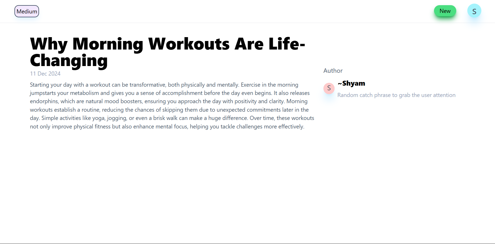

# Blog Writing Website

A blog-writing platform inspired by Medium, where users can sign up, log in, and create or read blogs. Users can also edit their own blogs.

---

## Features

- **User Authentication**: Users can sign up or log in to access the platform.
- **Blog Creation**: Authenticated users can write new blogs and save them to the database.
- **Blog Reading**: All blogs are accessible to any user for reading.
- **Blog Editing**: Users can edit blogs they have created.
- **Responsive Design**: The platform is optimized for desktop and mobile devices.

---

## Technologies Used

- **Frontend**: React with TypeScript
- **Backend**: Hono (Edge-compatible framework)
- **Database**: PostgreSQL
- **Deployment**: Cloudflare

---

## Screenshots

1. **Landing Page**
   - A welcoming page showcasing the platform’s features.

   

2. **Sign-Up and Sign-In Pages**
   - Screens for user authentication.

     
   

3. **Home Page**
   - A dashboard showing all available blogs.

   

4. **Blog Reading Page**
   - A detailed view of an individual blog.

   

5. **Blog Writing Page**
   - An interface for creating and editing blogs.

   

---

## Setup and Installation

1. **Clone the Repository**
   ```bash
   git clone https://github.com/SniperXyZ011/Medium-blog-project.git
   ```

2. **Install Dependencies**
   ```bash
   npm install
   ```

3. **Set Up the Database**
   - Configure your PostgreSQL database and update the environment variables in `.env` file:
     ```env
     DATABASE_URL=your_database_url
     ```

4. **Run the Development Server**
   ```bash
   npm run dev
   ```

5. **Build and Deploy**
   - Use Cloudflare for deployment. Run the build command:
     ```bash
     npm run build
     ```
   - Deploy the built files to your Cloudflare Workers or Pages.

---

## Future Enhancements

- Add support for rich text editing in blog creation.
- Implement a search feature to find blogs by title or author.
- Introduce categories and tags for better blog organization.
- Allow users to leave comments on blogs.

---

## Contribution

Contributions are welcome! Feel free to fork the repository and submit a pull request with your changes.

---

## License

This project is licensed under the MIT License. See the LICENSE file for details.

---

## Contact

For any questions or feedback, please contact:
- **Your Name**: [shyamprajapatiofficial2011@gmail.com]  
- **GitHub**: [https://github.com/SniperXyZ011]

